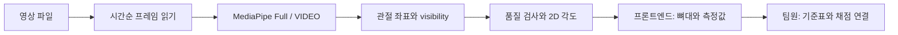

# 관절 추적 MVP

2026-10-09 대표 결정: 이 세션은 관절 추적과 자세 측정에 집중한다. 채점 규칙의 상세는 임서현·한다현이 정리한다. 포즈 모델은 **MediaPipe Pose Landmarker Full** 하나만 사용한다. 별도 좌표 필터, 모델 비교, 3차원 평가, AI 초안은 이 엔진 변경에 넣지 않는다.

## 목표와 완료 기준

프론트엔드에서 영상 파일을 넘기면 시각별 33개 관절, 관절별 상태, 측정 가능한 자세 각도와 측정 불가 이유를 돌려준다. 완성 여부는 실제 작업 영상에서 결과를 화면에 연결하고 확인한 뒤 판단한다. 타입 검사를 통과한 것만으로 영상 정확도 검증을 대신하지 않는다.



## 변경 대상과 연결

- `lib/pose/video.ts`: 브라우저 전용 `analyzeVideo(file, options)`.
- `lib/analysis.ts`: 모델 출력이 이미 있으면 `analyzePoses(frames, size, options)`로 다시 측정.
- `lib/angles/frame.ts`: 측정할 쪽과 방향, 관절 상태, 영상 비율을 반영한 각도.
- `lib/types.ts`: 프론트엔드와 공유하는 결과 타입.
- `scripts/prepare-pose.mjs`: WASM 복사와 고정 버전 Full 모델 준비.

페이지, 기준표, 법령 해석과 채점 로직은 이 변경에서 작성하지 않는다. 이미 공유한 채점 계약은 예정 사항이며 현재 엔진에는 REBA 계산 함수가 없다. 팀원 변경과 해커톤 사진은 건드리지 않는다.

## 준비와 프론트엔드 호출

```bash
npm ci
npm run prepare:pose
npm run typecheck
```

`prepare:pose`는 패키지의 WASM을 `public/wasm`에 복사하고 Full v1 모델을 `public/models`에 받는다. 모델 다운로드에는 네트워크가 필요하다. 두 폴더는 생성 자산이라 Git에 넣지 않는다. 배포 빌드 **전에** 이 명령을 실행해야 한다. Next.js를 붙일 때 빌드 명령은 `npm run prepare:pose && next build`로 설정한다.

클라이언트 코드에서:

```ts
import { analyzeVideo } from "../lib/pose/video";

const abort = new AbortController();
const result = await analyzeVideo(file, {
  signal: abort.signal,
  onProgress: (processed, total) => setProgress(processed / total),
});
// 취소: abort.abort()
// 실패: try/catch에서 오류 메시지를 표시
```

위 코드는 프론트엔드 연결 예시다. `setProgress`는 화면 담당자가 제공한다. 분석 진행 중에는 중복 호출을 막는다. 첫 모델 초기화는 진행률 콜백 전에 발생한다.

| 결과 | 의미 |
| --- | --- |
| `status` | 사용 가능한 장면이 60% 이상이면 ready, 아니면 retake |
| `size` | 디코딩한 영상의 실제 가로·세로 |
| `side`, `facing` | 영상 전체에서 고정한 측정 쪽, 화면상 바라보는 방향 |
| `frames[].timeSec` | 장면 시각, 초 |
| `frames[].landmarks` | 정규화한 모델 좌표와 visibility, 임의 보간 없음 |
| `frames[].jointStatus` | reliable / occluded / out_of_frame / invalid |
| `frames[].angles` | trunk, neck, knee, upperArm, lowerArm, wrist, 단위 도. 측정 불가면 null |
| `frames[].wristReliable` | 검지 관절까지 확인해 손목 각도를 만들었는지 |
| `frames[].reasons` | 장면별 사용 불가 이유 |
| `usableRatio`, `reasonCounts` | 사용 가능한 장면 비율과 실패 사유별 장면 수 |
| `runtime` | 모델 경로, 실제 GPU/CPU 실행, 전체 시간과 추론 시간 |

관절은 모델의 33개 인덱스 순서다. `side`는 사람 기준 왼쪽/오른쪽이며 화면상 좌우와 다르다. 뼈대 표시할 때 x·y에 영상 표시 영역의 가로·세로를 곱하고, object-fit의 여백을 맞춘다. 관절 신뢰도가 낮으면 정상 관절처럼 잇지 않는다.

## 측정 원칙과 한계

- 기본 0.1초 간격, 최대 60초·250MB의 한 사람 옆모습 영상을 받는다. 시간순 VIDEO 모드로 처리하며 외부로 영상을 업로드하지 않는다.
- 다중 인물 여부를 확인하려고 최대 2명을 검출한다. 두 명 이상 감지한 장면은 사용하지 않는다. 미검출 인물이 없는 것까지 보장하지는 않는다.
- GPU 초기화 실패 시 CPU로 한 번 재시도한다. 매 분석마다 새 모델을 만들고 마지막에 닫는다.
- 프레임의 원래 가로·세로 비율을 반영한다. 한 영상에서 같은 쪽 관절을 측정한다. 앞뒤로 돌거나 측정 대상이 바뀌는 영상은 잘라서 다시 분석한다.
- 무릎은 선택한 쪽의 굽힘을 반환한다. 양쪽 최대값을 섞지 않는다. 손목은 검지의 신뢰도가 낮으면 null이다. 검지 좌표를 이용한 손목 측정 자체는 근사치다.
- 목은 귀와 어깨로 만든 영상 평면상의 각도다. 해부학적 목 굽힘의 정답은 아니다. `neckNeutralOffsetDeg` 보정값은 실제 촬영으로 정한다.
- 관절 visibility는 실제 위치 오차나 정확도 백분율이 아니다. 가림 검사용 값이다. 정면 판정은 양쪽 골반이 보일 때만 쓰는 보조 조건으로, 촬영 방향 전체를 확정하지 않는다.
- 기본 품질 임계값은 제품 선택이며 실제 영상으로 아직 보정하지 않았다. 자동 방향이 안 잡히면 프론트엔드가 `side`와 `facing`을 사용자에게 확인받아 넘길 수 있다.
- 모델 추론은 메인 스레드를 잠시 막는다. 프레임 사이에는 이벤트 처리를 양보하지만 추론 도중 취소는 즉시 적용되지 않는다. worker 전환은 MVP 이후로 미룬다.

## 검증 방법과 현재 상태

- 합성 관절의 알려진 각도, 영상 비율, 좌우 반전, 관절 누락·가림·다중 인물에 대한 작은 검증 파일은 `tests`에 있다.
- 타입 검사 통과, 공식 모델 파일 다운로드 및 WASM 준비를 확인했다. 이번 범위 축소 후 테스트 실행과 실제 영상 추론은 아직 하지 않았다.
- 실제 영상에서 사람이 표시한 관절 위치·각도와 비교해야 정확도를 말할 수 있다. 관절 오차는 픽셀 또는 몸통 길이 대비 값으로, 각도 오차는 도 단위로 기록한다. 실패 장면도 분모에 남긴다.
- 프론트엔드 연결, 배포, Safari/iPhone 동작은 아직 확인하지 않았다.

## 외부 자산

- [`@mediapipe/tasks-vision` 공식 문서](https://developers.google.com/edge/mediapipe/solutions/vision/pose_landmarker/web_js), 패키지 0.10.34, Apache-2.0.
- [모델 종류와 관절 인덱스](https://developers.google.com/edge/mediapipe/solutions/vision/pose_landmarker).
- [Full float16 v1 모델](https://storage.googleapis.com/mediapipe-models/pose_landmarker/pose_landmarker_full/float16/1/pose_landmarker_full.task), Apache-2.0([공식 모델 카드](https://storage.googleapis.com/mediapipe-assets/Model%20Card%20BlazePose%20GHUM%203D.pdf)). 준비 명령은 10/9 공식 파일에서 확인한 SHA256으로 다운로드와 캐시 무결성을 검사한다.
